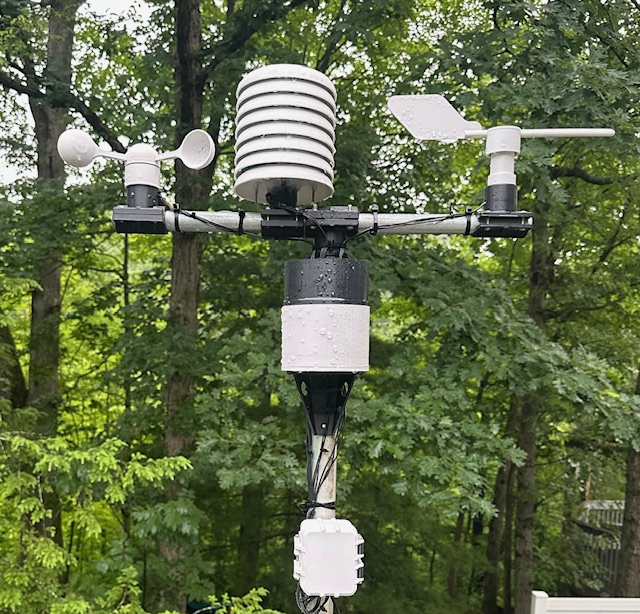

# WeatherPi

Weather station that uploads observations to Weather Underground and AdafruitIO.

Live weather data:
https://www.wunderground.com/dashboard/pws/KOHWESTE95

_**Collects the following weather observations**_
1) Wind Direction
2) Wind Speed (mph)
3) Wind Gust (mph)
4) Wind Gust Direction
5) Wind Speed Average 2 Min (mph)
6) Wind Direction Average 2 Min
7) Wind Gust Average 10 Min (mph)
8) Wind Gust Direction 10 Min (mph)
9) Rain (in)
10) Daily Rain (in)
11) Humidity
12) Dew Point (f)
13) Temp (f)
14) Relative Barometer (inHP)
15) UV
16) Solar Radiation
17) Air Quality PM2.5
18) Air Quality PM10
    
_**3D Printed Parts**_

These prints were gathered mainly from Thingiverse (with some modifications). I added attribution as appropriate. For the pole mounts, I resized these to fit my printed parts since the mounts weren't designed for these components.

_**Python Code**_

Weather data is called from a Cron script to update Weather Underground and AdafruitIO every 5 minutes (wind speed data and wind direction is updated to the local SQLite database via Cron every minute). Data observations, after a sucessful post to Weather Underground, are saved to the SQLite3 database. Database schema is very simple and is documented in the code (table create SQL).

_**Hardware**_
1) **Controller** -- RaspberryPi Zero W (used 2 because solar radiation/air quality sensors are in a different enclosure from the rest of the weather station).
3) **Temperature, Humidity, Pressure, Altitude, Dew Point** -- BME280
4) **Wind Direction** -- 12-Bit Hall Angle Sensor, 0.088° Resolution, 360° Rotation, 0-5V Output 
5) **Anemometer (wind speed sensor)** --  A3144/OH3144/AH3144E Hall Effect Sensor
6) **Rain Bucket** -- LM393 Speed Measuring Module Tacho Sensor Slot Type IR Optocoupler
7) **UV Solar Radiation** -- Adafruit 1918 Analog UV Light Sensor Breakout - GUVA-S12SD
8) **PM1.0, PM2.5 and PM10.0 Concentration (air quality)** -- Adafruit PMSA003I Air Quality Breakout - STEMMA QT
9) **Analog-to-Digital ADC Converter** -- ADS1115 4 Channel 16 Bit 16 Byte I2C IIC ADC Module with Pro Gain Amplifier
